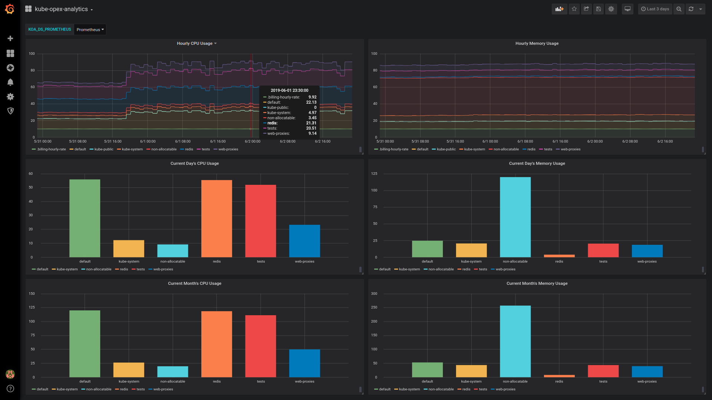

# Promehtheus Exporter and Grafana dashboards
This section describes how to set up Grafana dashboards thanks to `kube-opex-analytics`' Prometheus exporter.

- [Promehtheus Exporter and Grafana dashboards](#promehtheus-exporter-and-grafana-dashboards)
  - [Prometheus Exporter](#prometheus-exporter)
  - [Default Grafana Dashboard](#default-grafana-dashboard)
    - [Importation and configuration](#importation-and-configuration)
    - [Overview of the default dashboard](#overview-of-the-default-dashboard)



## Prometheus Exporter
`kube-opex-analytics` enables a Prometheus exporter through the endpoint `/metrics`.

The exporter exposes the following metrics:

* `koa_namespace_hourly_usage` exposes for each namespace its current hourly resource usage for both CPU and memory.
* `koa_namespace_daily_usage` exposes for each namespace and for the ongoing day, its current resource usage for both CPU and memory.
* `koa_namespace_monthly_usage` exposes for each namespace and for the ongoing month, its current resource usage for both CPU and memory.

The Prometheus scraping job can be configured like below (adapt the target URL if needed). A scraping interval less than 5 minutes (i.e. `300s`) is useless as `kube-opex-analytics` would not generate any new metrics in the meantime.


```
scrape_configs:
  - job_name: 'kube-opex-analytics'
    scrape_interval: 300s
    static_configs:
      - targets: ['kube-opex-analytics:5483']
```

> When the paramater `prometheusOperator` is enabled during the deployment (see Helm [values.yaml](./helm/kube-opex-analytics/values.yaml) file), you have nothing to do as the scraping should be automatically configured by the deployed `Prometheus ServiceMonitor`.

## Default Grafana Dashboard
There is an official Grafana dashboard available in the [./third-parties/grafana/](https://github.com/rchakode/kube-opex-analytics/tree/main/third-parties/grafana) folder.

The dashboard looks as below and is designed to work out-of-the box with the [Prometheus exporter](#prometheus-exporter). It would just require a couple of minutes to make it work. 

### Importation and configuration

 * Download the dashboard and import it in Grafana.
 * Create a Grafana variable named `KOA_DS_PROMETHEUS` and point to your Prometheus server data source.
 * You're done.

### Overview of the default dashboard
The dashboard currently provides the following charts (see screenshot below):

* Hourly resource usage over time.
* Current day's ongoing resource usage.
* Current month's ongoing resource usage.

> This default Grafana dashboard has less features compared against the ones enabled by the built-in dashboards. In particular, the daily and the monthly usage for the different namespaces are not stacked, neither than we have no analytics charts for past days and months. These limitations are inherent to how Grafana handles timeseries and bar charts.
